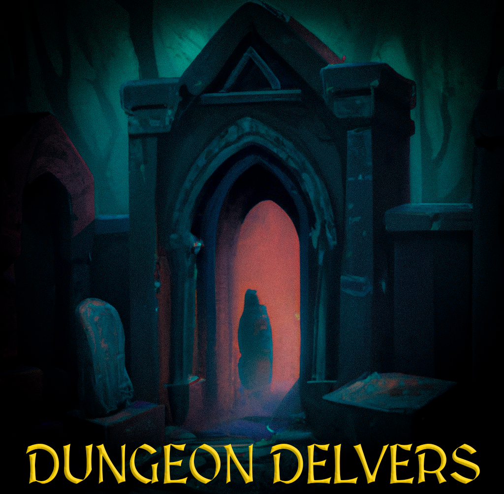

# 

A 3D "Roguelike" dungeon crawling game. Dungeons are generated with Binary-Space
Partitioning.

## 🕹️ Testing

A demo is available here https://mealeyst.github.io/dungeon_delvers/.

## 💻 Running

To run the game locally run the following commands:

1. `git clone git@github.com:mealeyst/dungeon_delvers.git`
2. `cd dungeon_delvers`
3. 'npm install`
4. 'npm start`

This should load up a local development server that you can hit at
http://localhost:1234/

## 📕 Features

- Full 3D world brought to you by the wonderful team over at
  [BabylonJS](https://www.babylonjs.com/)
- Dungeon generated with Binary-Space Partitioning thanks in large part to
  [halftheopposite](https://github.com/halftheopposite) and his work on
  [bsp-dungeon-generator](https://github.com/halftheopposite/bsp-dungeon-generator/tree/main)

## Licenses

This project is under the
[ISC](https://github.com/mealeyst/dungeon_delvers/blob/main/LICENSE) license.
